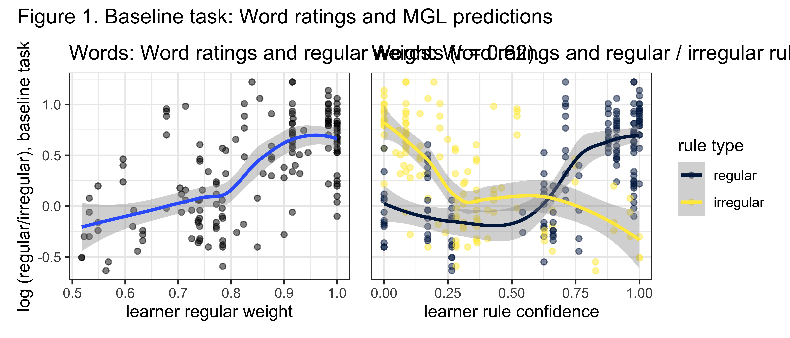
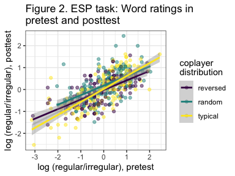
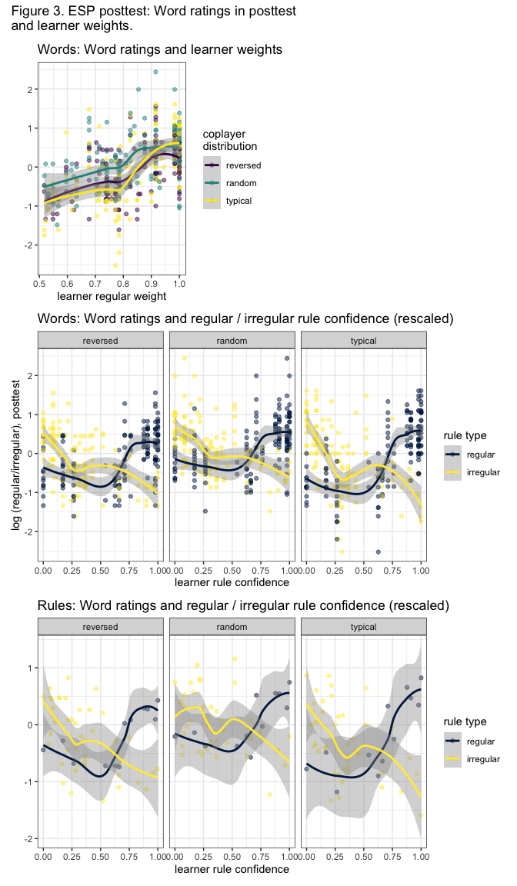
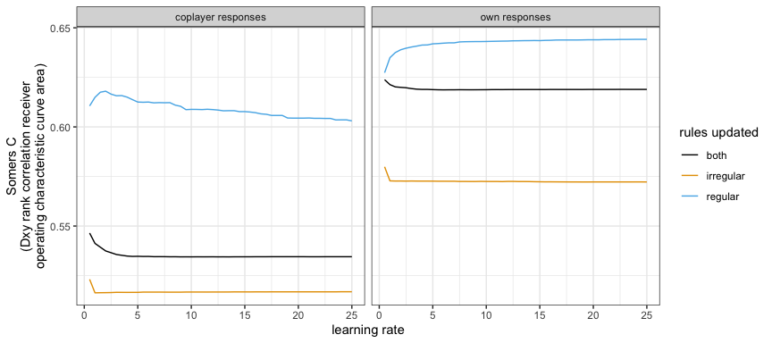
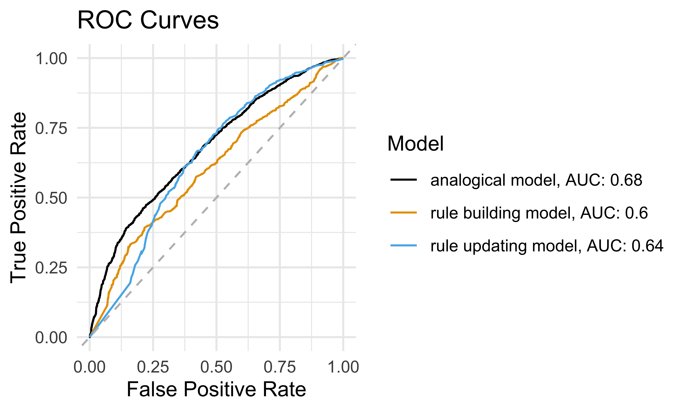

Tuning minimal generalisations on a morphological learning task
================
Rácz, Péter
7 April, 2025

A cognitively plausible model of people’s morphophonological intuitions
in a Wug task is the Minimal Generalisation Learner (MGL). The MGL looks
for generalisations of the type `CAD ~ CBD`, which can be expressed as a
rule `A -> B` with the structural description of `C _ D`. We can train
the MGL on existing words and it will predict people’s responses to
nonword stimuli. Here, we explore how the MGL can include short-term
learning based on nonword stimuli. We use the data collected by Rácz,
Beckner, Hay & Pierrehumbert (2020), who ran a baseline Wug task and a
morphological learning task (which they call the ESP task), using an
artificial coplayer. Both tasks focussed on the regular / irregular
variation of the English past tense.

Table 1 shows an example of how the learner works.

| rule_number | rule_tidy | reliability | scope | hits | confidence | related_forms | exceptions |
|---:|:---|---:|---:|---:|---:|:---|:---|
| 1 | \[\] -\> t / \[0 syllabic, 0 voice\] \_ \[\] | 0.95 | 1779 | 1695 | 0.94 | look, want, ask, work, talk, start, help, stop, like, wait, weight, walk, expect, pass, reach, develop, watch, produce, increase, suggest | get, think, take, put, keep, sit, write, right, let, speak, set, eat, meet, break, brake, catch, cut, forget, teach, fight, shake |
| 2 | I -\> { / \[0 syllabic, 1 COR\] » \_ Nk \[\] | 0.33 | 12 | 4 | 0.33 | drink, sink, shrink, stink | think, link, shrink, blink, stink, clink, rethink, slink |

1. Example rules for “splink”

# The baseline experiment

## Nonwords

Rácz, Beckner, Hay & Pierrehumbert (2020) generated nonword verbs across
four regular/irregular categories:

- drove (\[aI\]/\[i\] → \[oU\])
- sang (\[I\] → \[ae\])
- kept (\[i\] → \[E\]Ct)
- burnt (\[3\]/\[E\]/\[I\] → \[3\]/\[E\]/\[I\]Ct)

Nonwords were transcribed into the DISC phonetic alphabet. Examples are
in Table 2.

| burnt           | drove           | kept             | sang               |
|:----------------|:----------------|:-----------------|:-------------------|
| snurn, \[sn3n\] | snine, \[sn2n\] | kleem, \[klim\]  | grink, \[grINk\]   |
| trell, \[trEl\] | slive, \[sl2v\] | shreep, \[Srip\] | smink, \[smINk\]   |
| prurn, \[pr3n\] | quide, \[kw2d\] | pleel, \[plil\]  | thring, \[TrIN\]   |
| drell, \[drEl\] | klide, \[kl2d\] | geem, \[gim\]    | glink, \[glINk\]   |
| thurn, \[T3n\]  | vrite, \[vr2t\] | dreep, \[drip\]  | skrink, \[skrINk\] |

2. Nonword examples.

## Test data

202 participants, recruited on AMT, responded to the orthographic
present tense form of each nonword in a simple carrier sentence in a
forced-choice task. They could pick the regular or the irregular past
tense form for each nonword, displayed on buttons. The regular past
tense form was the -ed form. The irregular form depended on the verb
class, as seen in Table 3.

| category | word   | regular_form | irregular_form |
|:---------|:-------|:-------------|:---------------|
| burnt    | trurn  | trurned      | trurnt         |
| burnt    | sprurn | sprurned     | sprurnt        |
| drove    | slive  | slived       | slove          |
| drove    | klide  | klided       | klode          |
| kept     | skeep  | skeeped      | skept          |
| kept     | squeep | squeeped     | squept         |
| sang     | twim   | twimmed      | twam           |
| sang     | vink   | vinked       | vank           |

3. Regular and irregular choices in the Wug task.

## Minimal Generalisation Learner (MGL)

Rácz, Beckner, Hay and Pierrehumbert (2020) trained the Minimal
Generalisation Learner (MGL) on English verbs in CELEX and used it to
make predictions for the nonwords. They trained the MGL on regular and
irregular English verbs with a minimum frequency cutoff of 10: 4160
past/present verb transcriptions. They used the best parameters
identified by Albright & Hayes (2003) for a similar task: lower and
upper confidence limits of 55% and 95%.

The MGL generates 61 rules for the 156 target forms from the training
data. Such rules have a structural description that matches a target
nonword in the task and generates an output which is available to
participants to pick. A rule that generates the `sing -> sang` pattern
matches target forms for nonwords that look like `sing`. It generates
one of the past tense forms available in the forced-choice task. A rule
that generates the `sing -> sung` pattern does not generate an available
past tense form.

| rule_tidy | type | scope | hits | reliability | confidence | related_forms | exceptions |
|:---|:---|---:|---:|---:|---:|:---|:---|
| \[\] -\> d / \[-syllabic, -aperture, +voice, +LAB\] \_ \[\] | regular | 169 | 164 | 0.97 | 0.97 | seem, seam, describe, form, assume, claim, climb, perform, name, scream, blame, confirm, disturb, rub, absorb, inform, aim, grab, welcome, condemn | come, become, swim, dream, overcome |
| \[\] -\> t / \[-syllabic, -voice\] \_ \[\] | regular | 1779 | 1695 | 0.95 | 0.94 | look, want, ask, work, talk, start, help, stop, like, wait, weight, walk, expect, pass, reach, develop, watch, produce, increase, suggest | get, think, take, put, keep, sit, write, right, let, speak, set, eat, meet, break, brake, catch, cut, forget, teach, fight, shake |
| \[\] -\> d / \[-syllabic\] \_ \[\] | regular | 2602 | 2458 | 0.94 | 0.94 | look, want, ask, use, need, knead, work, live, talk, change, start, move, believe, help, stop, like, wait, weight, walk, expect, pass | get, think, take, give, find, put, leave, keep, sit, stand, hold, write, right, let, read, speak, lose, set, lead, understand |
| \[\] -\> d / \[-syllabic\] \_ \[\] | regular | 3510 | 3317 | 0.95 | 0.93 | look, want, seem, seam, ask, use, call, turn, need, knead, work, live, talk, change, start, happen, move, believe, help, stop, like | get, think, come, take, give, find, tell, feel, become, put, leave, mean, begin, keep, bring, sit, stand, hold, write, right |
| I -\> { / \[-syllabic, +COR\] » \_ N \[\] | irregular | 3 | 2 | 0.67 | 0.59 | ring, wring, sing | ring, wring |
| I -\> { / \[-syllabic, +COR\] r» \_ Nk \[\] | irregular | 3 | 2 | 0.67 | 0.59 | drink, shrink | shrink |
| I -\> { / \[-syllabic, +voice, +DORSAL\] » \_ \[-syllabic, 2 sonority, -aperture, +nasal, +voice\] | irregular | 5 | 2 | 0.40 | 0.39 | begin, swim | win, swing, wing |
| I -\> { / \[\] r» \_ N \[\] | irregular | 6 | 2 | 0.33 | 0.33 | ring, wring, spring | bring, spring, ring, wring, string |
| I -\> { / \[-syllabic\] r» \_ N \[\] | irregular | 9 | 3 | 0.33 | 0.33 | drink, spring, shrink | bring, spring, shrink, sprinkle, string, crinkle |
| I -\> { / \[-syllabic, +COR\] » \_ Nk \[\] | irregular | 12 | 4 | 0.33 | 0.33 | drink, sink, shrink, stink | think, link, shrink, blink, stink, clink, rethink, slink |
| I -\> { / \[-syllabic, +COR\] » \_ N \[\] | irregular | 10 | 3 | 0.30 | 0.30 | ring, wring, sing, spring | bring, spring, cling, fling, ring, wring, sling, string |
| I -\> { / \[-syllabic, +voice, +LAB\] » \_ \[-syllabic, -aperture, +voice\] | irregular | 8 | 2 | 0.25 | 0.26 | swim, forbid | win, swing, forbid, bid, wing, swig |
| I -\> { / \[-syllabic, +COR\] » \_ \[-syllabic, -aperture\] | irregular | 15 | 3 | 0.20 | 0.21 | sit, ring, wring, sing | sip, rip, lick, thin, ring, wring, ship, rig, sin, zip, shit, rim, ridge |
| I -\> { / \[-syllabic, 4 sonority, 2 aperture, +voice\] » \_ \[-syllabic, 2 sonority, -aperture, +nasal, +voice\] | irregular | 15 | 3 | 0.20 | 0.21 | ring, wring, swim, spring | bring, win, swing, spring, grin, trim, ring, wring, string, brim, wing, rim, chagrin |
| I -\> { / \[-syllabic, +COR\] » \_ N \[\] | irregular | 35 | 7 | 0.20 | 0.20 | drink, ring, wring, sing, sink, spring, shrink, stink | think, bring, link, spring, distinguish, cling, fling, shrink, blink, linger, sprinkle, wrinkle, sting, ring, wring, sling, string, relinquish, stink, extinguish |
| I -\> { / \[-syllabic\] » \_ \[-syllabic, 2 sonority, -aperture, +nasal, +voice\] | irregular | 22 | 4 | 0.18 | 0.18 | ring, wring, sing, swim, spring | bring, win, swing, spring, cling, grin, fling, trim, thin, ring, wring, sling, string, sin, brim, wing, rim, slim, chagrin |
| I -\> { / \[-syllabic\] » \_ \[-syllabic, 2 sonority, -aperture, +nasal, +voice\] | irregular | 13 | 2 | 0.15 | 0.16 | begin, sing | spin, pin, sting, skim, thin, tin, sin, skin, dim, underpin, ping |
| I -\> { / \[-syllabic, 4 sonority, 2 aperture, +voice\] » \_ \[-syllabic, 2 sonority, -aperture, +nasal, +voice\] | irregular | 45 | 5 | 0.11 | 0.10 | drink, ring, wring, swim, spring, shrink | bring, win, swing, print, spring, grin, shrink, sprinkle, wrinkle, dwindle, trim, rinse, wink, squint, ring, wring, discriminate, wince, string, whimper |
| I -\> { / \[-syllabic\] » \_ \[-syllabic, 2 sonority, -aperture, +nasal, +voice\] | irregular | 58 | 4 | 0.07 | 0.07 | begin, sing, sink, stink | think, continue, finish, distinguish, convince, spin, stimulate, pin, pinch, simmer, sting, symbolize, disintegrate, skim, simplify, thin, shimmer, assimilate, sympathize |
| I -\> { / \[-syllabic, +voice\] » \_ \[-syllabic, 2 sonority, -aperture, +nasal, +voice\] | irregular | 83 | 6 | 0.07 | 0.07 | begin, drink, ring, wring, swim, spring, shrink | bring, win, swing, link, limit, print, spring, convince, eliminate, cling, grin, diminish, fling, shrink, blink, linger, administer, sprinkle, wrinkle |

4. Rules from Celex.

Rules take the structural description of input -\> output / context.
Multiple rules can apply to the same input form. For the majority of
forms, there is one regular and one irregular rule available. For some,
there is no irregular rule. For some, there are more regular rules.
Let’s look at rules for the “sang” group only. Rules can be seen in
Table 4. Examples can be seen in Table 5.

| word | category | type | rule_tidy | confidence | weight |
|:---|:---|:---|:---|---:|---:|
| shing | sang | regular | \[\] -\> d / \[0 syllabic\] \_ \[\] | 0.93 | 0.61 |
| shing | sang | irregular | I -\> { / \[0 syllabic, 1 COR\] » \_ N \[\] | 0.59 | 0.61 |
| pring | sang | regular | \[\] -\> d / \[0 syllabic\] \_ \[\] | 0.93 | 0.74 |
| pring | sang | irregular | I -\> { / \[\] r» \_ N \[\] | 0.33 | 0.74 |
| grink | sang | regular | \[\] -\> t / \[0 syllabic, 0 voice\] \_ \[\] | 0.94 | 0.74 |
| grink | sang | irregular | I -\> { / \[0 syllabic\] r» \_ N \[\] | 0.33 | 0.74 |

Table 5. Best regular / irregular rules for some sang forms.

Following both Rácz, Beckner, Hay & Pierrehumbert (2020) and Albright &
Hayes (2003) we can pick the best regular and the best irregular rule
and calculate a weight, which is the confidence of the best regular rule
/ (the confidence of the best regular rule + the confidence of the best
irregular rule). If there is no irregular rule, this will default to 1.
We will work with the rules that are best rules for any form and call
these the relevant rules.

## Results

<!-- -->

Figure 1 shows how MGL predictions correlate with participant responses
in the baseline etask. The left panel shows the relationship between
word weights (x axis) and the log odds of regular and irregular choices
made by participants in the baseline task (y axis). The right panel
breaks down the weight into its two components: the best regular and
irregular rule for each word. Since, on the whole, regular rules have
higher confidence than irregular rules, we rescaled rule confidence
across these groups so they are more directly comparable.

The MGL weights correlate with the response odds. We see that the
trajectory of this relationship is built up from two opposite
trajectories for best rules. For words with low regular weight, this
weight comes from irregular rules that have low confidence themselves
but, relatively speaking, outweigh the relevant regular rules. For words
with higher regular weight, this comes from two things. First,
high-confidence, large-scale regular rules apply to these, and these
rules bring up the regular weight. Second, the relevant irregular rules
have very low confidence. This breakdown of the MGL’s regular weight
will become relevant later.

Note that, from the MGL’s perspective, the main technical difference
between regular and irregular rules is that regular rules tend to have
broader structural descriptions and will fit more existing words.
Whether a rule generates an `-ed` ending or e.g. changes a vowel is not
structurally different from the model’s point of view.

Rácz, Beckner, Hay & Pierrehumbert (2020) and Albright & Hayes (2003)
likewise find that the minimal generalisations (rules) of the MGL are
more accurate in predicting participant responses than an instance-based
learner, despite the higher level of abstraction.

# The ESP experiment

Rácz, Beckner, Hay & Pierrehumbert (2020) ran a second online experiment
using new participants and the nonwords from the baseline experiment.
Each participant went through three blocks. First, in the pretest phase,
they responded to 52 standalone nonwords in a forced-choice task,
identical to the baseline experiment. Second, in the ESP test phase,
they responded to a new set of 52 nonwords. This time they were playing
against a co-player and had to guess the coplayer’s pick in each trial.
Correct guesses were rewarded with a point. Coplayer behaviour was based
on the participant’s specific pretest behaviour and the baseline data.
Third, in the posttest phase, they responded to a new set of 52
nonwords, playing alone again. The ESP design is used widely in tasks
where it is important for descriptions to match, like image tagging. ESP
refers to the fact that participans have to “read” each other’s minds to
converge on a description. In this particular case, the participant had
to do all the mindreading, since the coplayer’s choices were set in
advance.

Coplayers varied across two conditions. In terms of (A) rate of
regularisation, the coplayer had (i) the same regularisation rate as the
participant in the pretest, (ii) regularised 40% more verbs, (iii)
regularised 40% fewer verbs. Participants who regularised too much or
too little (so that the entire effect of this shift would have been
capped by the floor or the ceiling of the 52 verbs in the ESP test) were
excluded. In terms of (B) lexical distribution, the coplayer regularised
the first n% verbs (n depending on A) that were rated most regular in
the baseline task (the typical coplayer), the first n% verbs that were
rated most irregular in the baseline task (the reversed coplayer), or n%
verbs at random (the random coplayer). This means that a typical
coplayer makes choices that are characteristic of an average
participant. A reversed coplayer turns these choices upside down.

## Results

Rácz, Beckner, Hay & Pierrehumbert (2020) found that the coplayer
changed participant behaviour. Nonword ratings shifted from the pretest
to the posttest. If participants rated words as highly regular in the
pretest, they rated these more irregular in the posttest, after
interacting with the reversed versus the typical coplayer. Since no
participant saw the same verb twice, this effect was due to lexical,
rather than word priming. The reversed coplayer used verbs in a certain
way, and the participant rated similar verbs in the posttest in a
certain way. The difference with the random coplayer was less clearcut.
This can be seen in Figure 2.

<!-- -->

Figure 2 compares response log odds in the pretest and the posttest.
These are correlated: participants make similar choices at the beginning
of the experiment and at the end, after encountering the coplayer.
However, this correlation is weaker if participants played a reversed
coplayer, demonstrating the coplayer’s influence.

# What changes in the posttest

The MGL predicts participant responses in general. So, if we look at how
MGL prediction accuracy varies across coplayers in the posttest, we find
a pattern similar to how these responses shift in the posttest.

The main effect of interest is coplayer lexical distribution. The MGL
weight has a stronger effect on posttest responses if the participant
played a typical coplayer. This makes sense: a typical coplayer
reinforces existing lexical distributions. The MGL’s predictive power
diminishes when it is set against participants who met a reversed
coplayer. What are the mechanics of this shift?

<!-- -->

Figure 3 shows the correlation of MGL predictions with participant
responses in the posttest, split across coplayer lexical distribution.

The top panel shows individual word weights. It is similar to Figure 2.
The MGL is the best at predicting the posttest condition that is closest
to the baseline, which is the typical condition. The correlation is
weaker for responses by participants who encountered a reversed or a
random coplayer. The middle panel shows this relationship broken down to
the two contributing factors to an MGL weight: the best regular and the
best irregular rule for each word. Looking at Figure 2, we said that low
weights follow from relevant irregular rules outweighing regular rules
in confidence, while, for high weights, this relationship is reversed.
Here we see that participants follow this pattern in the typical
condition but diverge from it in the reversed and random conditions:
their choices reflect a smaller difference between regular and irregular
rules than what is predicted by the MGL, and this means that the MGL
undershoots irregular verbs and overshoots regular verbs. We see the
same relationship in the bottom panel, where we look at confidences and
ratings aggregated over individual rules rather than individual words.
For each rule, we count the regular and irregular posttest responses for
all the nonword verbs in its scope, given that, for each verb, no rule
of higher confidence was available. These are the verbs for which this
is the best regular / irregular rule. We then plot this against the
rule’s confidence. Participants in the random and reversed conditions
act as if the regular rules and the irregular rules were closer to each
other, which is why the MGL has lower accuracy than in the typical
condition (or the baseline task).

Posttest patterns come to existence during the interactive session with
the coplayer, the ESP task. Participants gradually diverge from the MGL
predictions during the ESP task. We visualise this in Figure 4. The top
panel shows the relationship between MGL weights and participant
responses in each of the 52 trials of the ESP task. For each trial, we
calculated a Pearson correlation between word weights and participant
responses across the three coplayer lexical distributions. Trials are
shown on the x axis. The correlations are shown on the y axis. The
correlations vary a lot, so we only plot a loess smooth for each
condition. We see that the correlations hold steady for the typical
condition, where the coplayer makes lexically typical choices. They
gradually deteriorate across the other conditions, in which the
coplayer’s choices go against the participants’ (and the MGL’s) expected
lexical distributions. The bottom panel breaks this down into regular
and irregular rules. The two rule types move in tandem: it is not the
case that the overall trajectory shifts because of the behaviour of the
regular rules, for instance.

<!-- -->

# Modelling

The main result of Rácz, Beckner, Hay & Pierrehumbert (2020) is that,
when you expose participants to a lexical distribution in the ESP task,
they will extend this distribution to previously unseen forms in the
posttest, to some extent.

The MGL can capture this shift through rules or minimal generalisations.
Participants see different verbs in the ESP task and the posttest. The
rules that apply to these verbs will overlap. This will be especially
true for rules that have broad structural descriptions and thus apply to
many forms. These tend to be regular rules.

| rule_tidy | type | scope | phase |
|:---|:---|---:|:---|
| \[\] -\> d / \[-syllabic\] \_ \[\] | regular | 3510 | esp, posttest |
| \[\] -\> t / \[-syllabic, -voice\] \_ \[\] | regular | 1779 | esp, posttest |
| \[\] -\> d / \[-syllabic, -aperture, +voice, +LAB\] \_ \[\] | regular | 169 | esp, posttest |
| I -\> { / \[-syllabic, 4 sonority, 2 aperture, +voice\] » \_ \[-syllabic, 2 sonority, -aperture, +nasal, +voice\] | irregular | 45 | esp, posttest |
| I -\> { / \[-syllabic, +COR\] » \_ N \[\] | irregular | 10 | esp, posttest |
| I -\> { / \[-syllabic, +voice, +LAB\] » \_ \[-syllabic, -aperture, +voice\] | irregular | 8 | esp, posttest |
| I -\> { / \[-syllabic, +voice, +DORSAL\] » \_ \[-syllabic, 2 sonority, -aperture, +nasal, +voice\] | irregular | 5 | esp, posttest |
| I -\> { / \[-syllabic, +COR\] » \_ N \[\] | irregular | 35 | esp |
| I -\> { / \[-syllabic, +COR\] » \_ \[-syllabic, -aperture\] | irregular | 15 | esp |
| I -\> { / \[-syllabic, 4 sonority, 2 aperture, +voice\] » \_ \[-syllabic, 2 sonority, -aperture, +nasal, +voice\] | irregular | 15 | esp |
| I -\> { / \[-syllabic, +COR\] » \_ Nk \[\] | irregular | 12 | esp |
| I -\> { / \[\] r» \_ N \[\] | irregular | 6 | esp |
| I -\> { / \[-syllabic, +voice\] » \_ \[-syllabic, 2 sonority, -aperture, +nasal, +voice\] | irregular | 83 | posttest |
| I -\> { / \[-syllabic\] » \_ \[-syllabic, 2 sonority, -aperture, +nasal, +voice\] | irregular | 58 | posttest |
| I -\> { / \[-syllabic\] » \_ \[-syllabic, 2 sonority, -aperture, +nasal, +voice\] | irregular | 22 | posttest |
| I -\> { / \[-syllabic\] r» \_ N \[\] | irregular | 9 | posttest |

Table 6. Rule overlaps for one participant (sang verbs)

To illustrate this point, we show one participant and one category,
‘sang’, in Table 6. Taken together, 16 relevant rules apply to the 104
verbs that our participant sees in the ESP task and the posttest. 7
rules overlap: they apply to some verbs in both tasks. 5 rules only
apply to verbs in the ESP task. Following the MGL logic, whatever the
participant learned about these verbs won’t carry over to the posttest.
4 rules only apply to verbs in the posttest. The participant didn’t
learn anything new about these verbs. Unsurprisingly, the rules that
overlap have much larger scopes (a mean of 789) than those which do not
(a mean of 28). 3 overlapping rules are regular, only 0 non-overlapping
rule is regular.

This suggests that whatever the participant learns about the regular
rules will be far more influential in the posttest than what they learn
about irregular rules.

One way to express learning is to adjust rule confidence for rules in
the ESP task. We will do this in the following way: For each participant
and rule in the ESP task, we tally the number of regular and irregular
responses by the participant in the ESP task. We do this for the
reversed condition only.

If the rule is regular, it works very well if every verb it applies gets
a regular response. For every regular response, the rule is rewarded.
For every irregular response, the rule incurs a penalty. If the rule is
irregular, all the verbs in its scope should be irregular. For every
irregular response, the rule is rewarded. For every regular response,
the rule incurs a penalty.

These total rewards and penalties are used to update the rule’s
confidence. If the participant starts the ESP task with a very strong
regular rule but keeps picking irregular forms for verbs in the rule’s
scope, the rule’s confidence is steadily demoted. If the rule works well
across the task, its confidence will increase. The rate of this increase
/ decrease is controlled by the parameter `learning rate`, which ranges
between 0.5 and 25, with a .5 step. We fit the rule updater with two
extra hyperparameters. These are (a) rule type ((i) updating both
regular and irregular rules, (ii) updating regular rules only, (iii)
updating irregular rules only) and (b) response type ((i) updating based
on co-player responses or (ii) the participant’s own responses in the
ESP test phase).

<!-- -->

Figure 5 shows how the updated rules fare in the reversed condition
posttest. The x axis shows model learning rate, the y axis shows model
accuracy, as expressed by the concordance index ‘C’ of the individual
participant responses and the model prediction. The colours show which
rules were updated in a given model. The two panels show models trained
on player or co-player responses. The best model is trained on the
participant’s own responses, tunes regular rules only, and has a
comparatively high learning rate. This can be seen in Table 7.

| learning_rate | which_rules | which_responses |    c |
|--------------:|:------------|:----------------|-----:|
|          24.5 | regular     | own             | 0.64 |
|           0.5 | both        | own             | 0.62 |
|           2.0 | regular     | coplayer        | 0.62 |
|           0.5 | irregular   | own             | 0.58 |
|           0.5 | both        | coplayer        | 0.55 |
|           0.5 | irregular   | coplayer        | 0.52 |

Table 7. Best outcomes for the updating model

How does this compare with the original models?

We fit a hierarchical logistic regression model predicting participant
responses across the reversed condition, using baseline and individual
model weights as a predictor and a participant grouping factor. We
compare the GCM, the baseline + individual MGL, and the baseline +
updating MGL. We fit separate models because of collinearity issues.

| Name | Model | AIC | AIC_wt | BIC | BIC_wt | R2_conditional | R2_marginal | ICC | RMSE |
|:---|:---|---:|---:|---:|---:|---:|---:|---:|---:|
| fit_gcm | glmerMod | 4128.51 | 0.00 | 4153.48 | 0.00 | 0.57 | 0.04 | 0.56 | 0.41 |
| fit_mgl_1 | glmerMod | 4106.21 | 0.01 | 4131.18 | 0.01 | 0.51 | 0.04 | 0.49 | 0.41 |
| fit_mgl_2 | glmerMod | 4097.29 | 0.99 | 4122.26 | 0.99 | 0.50 | 0.04 | 0.48 | 0.41 |

Table 9: Model comparison

In this set, the baseline + updating MGL is the best fit. There is more
mileage in tuning the GCM and the original MGL as well, but finding an
MGL setup that improves on the baseline is an important result.

If we ignore the hierarchy of the data, we can plot ROC curves for each
model.

<!-- -->

## Discussion

We trained the Minimal Generalisation Learner on real English verbs and
tested it on results of a forced-choice Wug task in which participants
had to pick the regular or irregular past tense form for nonwords. Like
in earlier work (Albright & Hayes 2003), the MGL can predict participant
behaviour in a Wug task.

We also tested the MGL on results from a morphological convergence
experiment in which participants are exposed to coplayers and have to
agree with them on choices in a forced-choice Wug task. Participants
will converge to the lexical distributions of the coplayer and subsist
with this distribution in a subsequent posttest, extending it to novel
noword forms.

Since the MGL was trained on real verbs which comprise a typical lexical
distribution, its predictions will be less accurate when measured
against participant choices after participants have been exposed to a
coplayer who reverses the typical distribution. We can tune the MGL to
better fit participant responses by using data from the participant’s
interaction with the coplayer and updating each MGL rule based on
participant choices during this interaction.

The morphological convergence experiment is unusual in how much it
showcases English irregular inflectional morphology. In reality, the
vast majority of existing English verb types is regular and irregular
lexical gangs take on new members very infrequently. In the experiment,
the use of irregular forms is rampant, both by the coplayers and the
participants (the mean rate of use for regular forms was 41% in the
baseline task).

One would then assume that if participants operate by establishing and
updating minimal morphophonological generalisations, they would tackle
the reversed coplayer by updating the irregular generalisations,
establishing heuristics such as “if words look like \<<sing>\> they are
much more likely to have a past tense like \<<sang>\> today”. However,
our simulations show that the best way to capture the change in
participant behaviour is to update the regular rules only. This is
likely because these rules apply to many forms: A regular rule adjusted
by many verbs in the ESP task will apply to many verbs in the posttest.
In contrast, while updating irregular rules may well better capture the
shifts we see in participant behaviour, they are too fragmented for this
to carry over from the learning phase (the ESP task) to retesting (the
posttest). This would mean that the heuristic above should be
reformulated as: “all words that look really regular should actually be
less regular today”.
